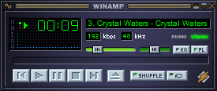

<div align="center">

# 🎵 ytm-winamp

**YouTube Music in classic Winamp — era-correct, country-localized, zero accounts.**

[](https://github.com/mcftira/ytm-winamp/releases/latest)
[](https://github.com/mcftira/ytm-winamp/actions/workflows/release.yml)
[](LICENSE)
[](https://github.com/mcftira/ytm-winamp)
[](https://github.com/mcftira/ytm-winamp/releases)

[Quick start](#-quick-start) ·
[Features](#-features) ·
[Era radio](#-the-era-radio-localized) ·
[How it works](#-how-it-works) ·
[FAQ](#-faq)



<sub>Actual capture: Crystal Waters streaming at 192 kbps with live ICY titles. Really whips the llama's ass.</sub>

</div>

---

## ✨ Features

| | |
| --- | --- |
| 📻 **Winamp-era radio** | One command queues a shuffled 1995–2005 hit parade — Darude, Eiffel 65, Zombie Nation, the Vengaboys… |
| 🌍 **Localized to your country** | Your IP's country is auto-detected and ~40% of the queue is that country's **actual number-one hits** of the era — fetched from real chart archives, never guessed |
| ⚡ **Snappy controls** | Upcoming tracks are prefetched and cached to disk; pressing **next** starts the next song in a fraction of a second |
| 🏷️ **Real titles in Winamp** | ICY (SHOUTcast-style) metadata, so the title bar and playlist show `Artist – Title` like a proper radio |
| 🎯 **Plays anything** | Search queries, video URLs, whole YouTube/YouTube Music playlists |
| ❤️ **Liked songs** | Optional: your YouTube Music likes via [`ytmusicapi`](https://ytmusicapi.readthedocs.io) auth |
| 📦 **Single-file exe** | No Python, no PATH surgery — download and go |
| 🪶 **No accounts, no API keys** | For everything above except liked songs |

## 🚀 Quick start

1. **Download** [`ytm-winamp-setup.exe`](https://github.com/mcftira/ytm-winamp/releases/latest) and run it — a proper installer wizard: the app, Winamp (via winget), portable yt-dlp/ffmpeg, shortcuts, and the default Winamp Modern theme.
2. Check **"Start the era radio"** on the finish page.
3. That's it — use the desktop/Start-menu shortcut next time, or `ytm-winamp` from any terminal.

Prefer portable? Grab the bare
[`ytm-winamp.exe`](https://github.com/mcftira/ytm-winamp/releases/latest/download/ytm-winamp.exe)
instead and run `ytm-winamp setup` once yourself.

<details>
<summary><b>Install from source instead</b></summary>

```sh
pipx install .          # or: pip install .[liked]
ytm-winamp setup
ytm-winamp
```

Requires Python 3.10+. Everything `setup` does is idempotent — whatever is
already installed is detected and left alone.

</details>

## 📻 The era radio, localized

Bare `ytm-winamp` (or `ytm-winamp era`) builds a radio queue of Winamp-era
hits, roughly 1995–2005. About 60% is the worldwide canon that was on every
playlist everywhere; the other 40% comes from **your own country's charts of
those years**.

Local chart data sources:

| Source | Countries | Notes |
| --- | --- | --- |
| Wikipedia national number-one lists (CC-BY-SA) | 🇩🇪 🇦🇹 🇨🇭 🇮🇹 🇪🇸 🇳🇱 🇵🇱 🇫🇷 🇮🇪 | `List of number-one hits of YYYY (…)` |
| [slagerlistak.hu](https://slagerlistak.hu) | 🇭🇺 | Year-end Rádiós Top 40 charts |

No list for your country yet? You get the global parade with a console note —
and adding one is a one-line page pattern in
[`charts.py`](src/ytm_winamp/charts.py). **PRs welcome.**

```sh
ytm-winamp era --country DE     # force a country (code or name)
ytm-winamp era --global-only    # skip local charts
ytm-winamp era -n 50            # bigger queue (default 25)
```

## 🔧 How it works

Winamp 5.x can't fetch YouTube directly — the googlevideo CDN rejects its HTTP
client (`[access denied]`, if you ever tried). So a tiny localhost bridge does
the fetching instead:

```
            search / URL / charts                 pre-resolved, cached
YouTube ───────────────▶ yt-dlp ──▶ ffmpeg ──▶ MP3 ──▶ http://127.0.0.1:8797 ──▶ Winamp
                                        (disk cache + prefetch)      (ICY titles)
```

- Stream URLs resolve **when a track downloads**, never when enqueued — googlevideo expiry is a non-issue
- Two download workers, one retry per track, graceful 502s — flaky networks don't freeze the player
- Titles ride along as ICY metadata; the playlist keeps `#EXTINF` titles like it's 1999

## 🎛 Commands

| Command | What it does |
| --- | --- |
| `ytm-winamp` | The era radio (same as `era`) |
| `ytm-winamp era [--country X] [--global-only] [-n N]` | Era hits, optionally localized |
| `ytm-winamp play <query or URL> [-n N]` | Search, video, or whole playlist |
| `ytm-winamp liked [--shuffle]` | Your YouTube Music liked songs ([auth needed](#-liked-songs-one-time-auth)) |
| `ytm-winamp search <query> [-n N]` | List results with URLs |
| `ytm-winamp setup` | First-run onboarding: Winamp + tools + theme |
| `ytm-winamp serve` | Run the bridge in the foreground (debugging) |

<details>
<summary><b>⚙️ Configuration reference</b></summary>

| Setting | How |
| --- | --- |
| Winamp path | set `YTM_WINAMP_EXE` if Winamp isn't in the default location |
| Bridge port | `--port` (default `8797`) |
| Bridge log | `%TEMP%\ytm-winamp-bridge.log` |
| Track cache | `%TEMP%\ytm-winamp-cache` (up to 32 tracks, LRU) |
| Portable tools | `%USERPROFILE%\.ytm-winamp\bin` |
| YT Music auth | `%USERPROFILE%\.ytm-winamp\ytmusic.json` |
| Era/geo data | `%USERPROFILE%\.ytm-winamp\` (`country.json`, `charts_*.json`, `era_cache.json`) |

</details>

<details>
<summary><b>❤️ Liked songs: one-time auth</b></summary>

Reading your liked songs requires a YouTube Music login via `ytmusicapi`
(bundled in the exe). Run **one** of these once, then move the resulting file
to `%USERPROFILE%\.ytm-winamp\ytmusic.json`:

```sh
ytmusicapi oauth     # recommended; needs a Google Cloud OAuth client
ytmusicapi browser   # paste request headers copied from music.youtube.com
```

Pass a different location with `ytm-winamp liked --auth <path>`.

</details>

## 🗺 Roadmap

- [x] Winamp-era radio with country-localized charts
- [x] ICY stream titles
- [x] Single-file exe + one-command setup
- [x] YouTube Music liked songs
- [ ] More countries in `COUNTRY_SOURCES`
- [ ] YouTube Music playlists by name
- [ ] System tray controller
- [ ] Seeking (needs Range requests in the bridge)

## ❓ FAQ

<details>
<summary><b>Does this download videos?</b></summary>

No. Audio is streamed and transcoded on the fly; a small rolling cache of
recent tracks (max 32) lives in `%TEMP%` and is evicted automatically.

</details>

<details>
<summary><b>Why does the first track take a few seconds?</b></summary>

Cold start: the bridge resolves and starts transcoding track one while
prefetching the rest of the queue behind it. After that, cached tracks switch
in a fraction of a second.

</details>

<details>
<summary><b>Winamp shows a video id instead of a title</b></summary>

You're on an old bridge from before ICY titles (v0.4.0). Re-run any play
command — the bridge restarts itself on the new code.

</details>

## 🤝 Contributing

Issues and PRs are welcome — especially new country sources for
[`COUNTRY_SOURCES`](src/ytm_winamp/charts.py) (see the
[era section](#-the-era-radio-localized)). Run the tests with
`python -m pytest tests/`.

## ⚖️ Disclaimer

Unofficial hobby project, not affiliated with Winamp, YouTube, or Google.
Streams audio through [yt-dlp](https://github.com/yt-dlp/yt-dlp) for personal
playback; make sure your usage complies with YouTube's Terms of Service and
applicable law. Chart data: Wikipedia (CC-BY-SA) and slagerlistak.hu.

---

<div align="center">

Made with 🦙 for the llama-whipping community · [MIT](LICENSE) · [back to top](#-ytm-winamp)

</div>
